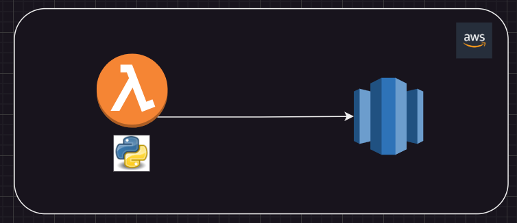
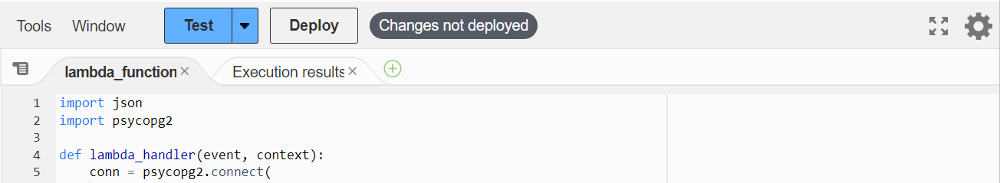
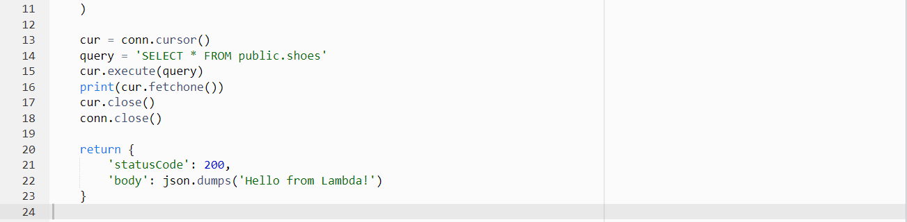
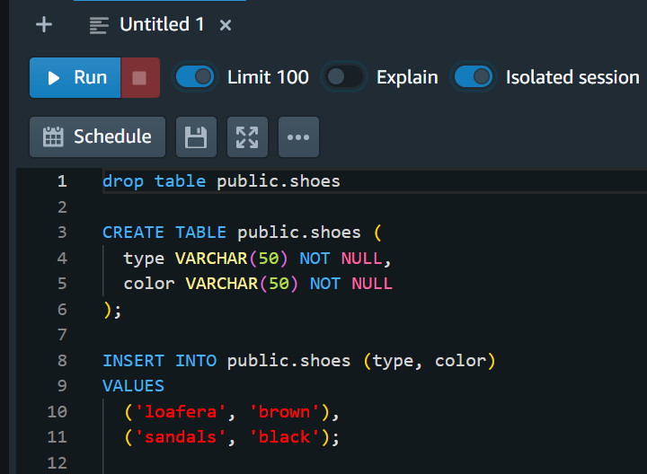
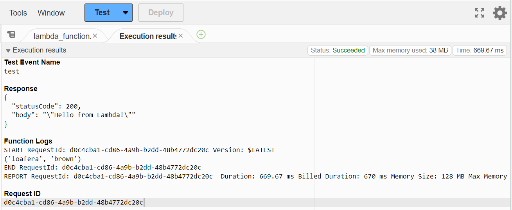

# Project

A query redshift poc using lambda 

## Tabla de Contenidos

- [Requirements](#requirements)
- [Architecture](#architecture)
- [Instalation](#instalation)
- [Use](#use)
- [Evidences](#evidences)
- [Contribution](#contribution)
- [References](#references)

## Requirements

aws account

## Architecture

## Instalation

-use python.zip or download psycopg2 from https://github.com/jkehler/awslambda-psycopg2 (in this poc we used psycopg2 3.7 the same as in lambda configuration) and upload lambda layer

-create lambda function using layer uploaded

-lambda code deploy without redshift connection in aws console 

-create redshift table and insert data in aws console

-lambda code deploy with redshift redshift in aws console  

## Use

##### Lambda

code

##### Redshift

table

## Evidences

lambda deployed

## Contribution

A yml could be added where the aws services are deployed

## References

all things aws

https://www.youtube.com/watch?v=A1zf7DveiUY&t=536s

psycopg2 repository

https://github.com/jkehler/awslambda-psycopg2

other poc with s3

https://www.youtube.com/watch?v=cFO2-gs56d8&t=333s